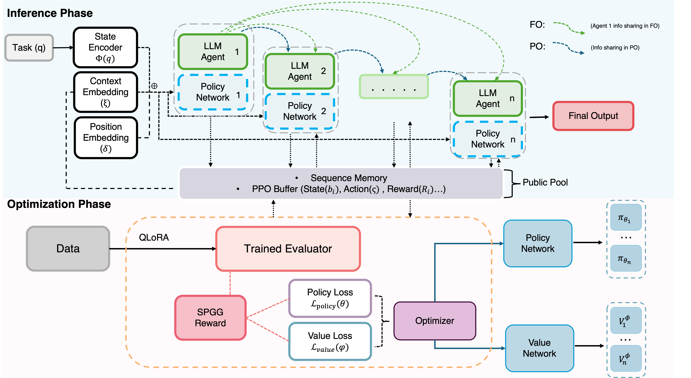
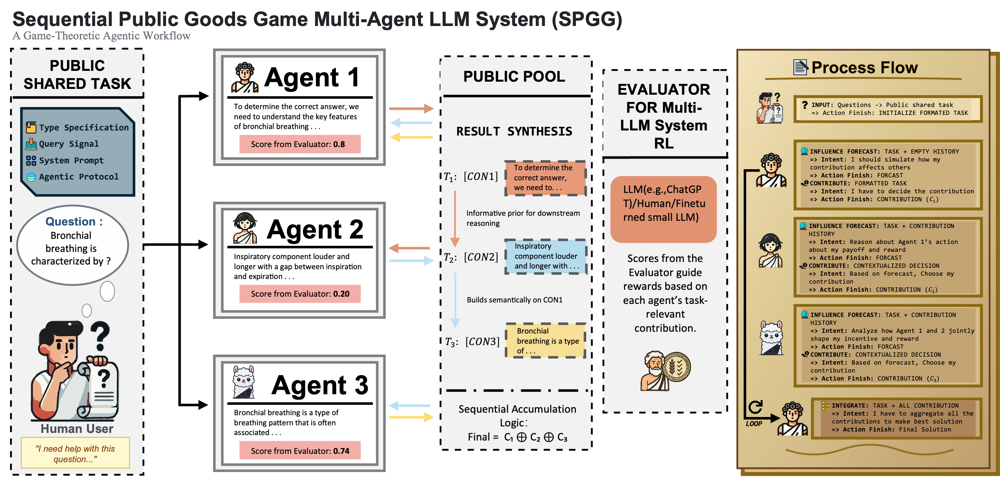

# MAC-SPGG: Multi-Agent Cooperation via Sequential Public Goods Games

<div align="center">

[](https://www.aamas2026.org/)
[](https://opensource.org/licenses/MIT)
[](https://www.python.org/downloads/)
[](https://pytorch.org/)

**A game-theoretic reinforcement learning framework for incentivizing strategic cooperation in multi-agent LLM systems**

[Paper](https://arxiv.org/abs/2508.02076)

</div>

---

## Overview

MAC-SPGG (Multi-Agent Cooperation Sequential Public Goods Game) addresses the fundamental challenge of coordinating multiple large language models to solve complex tasks collaboratively. Traditional multi-agent approaches suffer from free-riding behaviors and lack principled mechanisms for cooperation incentivization. We introduce a novel game-theoretic framework that:

- Eliminates free-riding through carefully designed reward mechanisms achieving unique Subgame Perfect Nash Equilibrium (SPNE)
- Reduces communication overhead via sequential decision-making protocol instead of costly round-based information exchanges
- Enables efficient cooperation rather than fine-tuning entire models

### Technical Innovation

Our framework combines three key innovations:

1. **Sequential Public Goods Game Mechanism**: Redesigned reward structure that makes effortful contribution the dominant strategy, proven to have unique SPNE under realistic parameter constraints.

2. **Policy Network-Driven Parameter Generation**: Instead of prompt engineering or model fine-tuning, we train lightweight policy networks that dynamically optimize each agent's contribution strategy.

3. **Multi-Aspect Quality Assessment**: QLoRA-trained evaluator (Qwen2.5-7B) providing fine-grained quality signals across relevance, coherence, consistency, and fluency dimensions for reward computation.

---

## Architecture

### System Overview



The framework operates in two distinct phases:

**Inference Phase**: Policy networks generate optimal generation parameters for each agent based on task encoding and agent position. Sequential agents execute with partial or full observation of predecessors' contributions.

**Optimization Phase**: The reward combines predictable and unpredictable components to incentivize cooperation.

### Game-Theoretic Formulation



**Sequential Decision Process**: Each agent observes the action history, decides its contribution quality level in [0,1], and receives rewards based on:
- **Individual cost**: Direct cost proportional to contribution effort
- **Cooperation bonus**: Reward scaled by predecessors' accumulated contributions
- **Public good sharing**: Equal distribution of total collective output
- **Collective penalty**: Applied when group fails to meet quality threshold

**SPNE Guarantees**: Under properly tuned cooperation coefficient (γ), public good multiplier (ρ), and threshold (B), our mechanism achieves unique Subgame Perfect Nash Equilibrium where all agents contribute maximally.

---

## Key Features

### Multi-Agent Collaboration
- **Heterogeneous Agent Ensemble**: Qwen3-8B, SmolLM2-1.7B, Llama3.1-8B
- **Observation Modes**: Configurable full/partial observation for different information scenarios
- **Sequential Protocol**: Position-aware contribution with strategic depth

---

## Project Structure

```
SPGG/
├── spgg/                                    # Main package
│   ├── api/                                 # API-based inference modules
│   │   └── core/                            # API core components
│   │       ├── agents.py                     # APIModelManager, agent implementations
│   │       ├── config.py                            
│   │       ├── networks.py                          
│   │       ├── encoders.py                          
│   │       └── utils.py                     # Parameter parsing, checkpoint loading
│   │
│   ├── checkpoints/                         # Model checkpoints
│   │   └── checkpoint.pt                    # Pre-trained policy networks
│   │
│   ├── evaluation/                          # Evaluation modules
│   │   ├── api/                             # API-based evaluation scripts
│   │   │   └── test/                        # API evaluation test scripts
│   │   └── local/                           # Local model evaluation
│   │       ├── core/                        # Local model inference modules
│   │       │   ├── agents.py                # LocalModelManager
│   │       │   ├── config.py
│   │       │   ├── networks.py
│   │       │   ├── encoders.py
│   │       │   └── utils.py
│   │       └── test/                        # Local evaluation test scripts
│   │
│   ├── training/                            # Training pipeline
│   │   └── evaluators/                      # Evaluator model training
│   │       ├── qwen2.5_evaluator_training.py    
│   │       └── utils/                       
│   │
│   └── utils/                               # Utility modules
│       ├── pgg_rl_utils.py                      
│       └── performance_metrics.py               
│
├── assets/                                  # Images and static resources
│   ├── work_flow.png                            
│   └── Workflow.png                             
│
└── requirements.txt                        
```

---

## Installation

### Requirements

- Python 3.8+
- PyTorch 2.0+
- CUDA 11.8+ 
- 16GB+ RAM (30GB+ recommended for local model evaluation)

### Setup

```bash
# Clone repository
git clone https://github.com/YunhaoLiang/MAC-SPGG.git
cd MAC-SPGG

# Install dependencies
pip install -r requirements.txt

# Configure API keys
cp .env.example .env
# Edit .env with your API credentials
```

### Environment Variables

```bash
# Required for API-based evaluation
TOGETHER_API_KEY=your_together_api_key        # Llama models
QWEN_API_KEY=your_dashscope_api_key          # Qwen models
HUGGINGFACE_TOKEN=your_hf_token              # Model downloads
```

---

## Quick Start

### Local Model Evaluation (Recommended)

**Partial Observation Mode** (Primary usage):
```bash
python spgg/evaluation/local/test/gsm8k_local_partial.py
```

**Full Observation Mode** (Ablation test):
```bash
python spgg/evaluation/local/test/gsm8k_local_full.py
```

**Note**: Requires sufficient GPU memory to load all three models simultaneously (recommend 30GB+ VRAM).

### API-Based Evaluation (Alternative)

If you prefer using API services instead of local models:

```bash
# Partial observation with API models
python spgg/evaluation/api/test/gsm8k_sequential_partial.py

# Full observation with API models
python spgg/evaluation/api/test/gsm8k_sequential_full.py
```

### Evaluator Training

```bash
cd spgg/training/evaluators
# Update paths in qwen2.5_evaluator_training.py
python qwen2.5_evaluator_training.py
```
---

## Checkpoints

The repository includes an inference checkpoint (`spgg/checkpoints/checkpoint.pt`, 3.0 MB) containing:

- `config`: Training configuration and hyperparameters
- `agents['Agent_Llama']['policy_net']`: Policy network for Llama
- `agents['Agent_SMOLLM2']['policy_net']`: Policy network for SmolLM2  
- `agents['Agent_Qwen']['policy_net']`: Policy network for Qwen

**Important Notes:**
- This checkpoint does not include any base LLM weights. Base models must be obtained from their original providers.
- The released checkpoint was trained under the Partial Observation protocol.
- Full Observation evaluation scripts use the same checkpoint as an ablation/generalization test.

---

## Observation Modes

### Partial Observation
Each agent observes only the immediately preceding agent's contribution:
- Agent 1 (Llama): No history, solves independently
- Agent 2 (SmolLM2): Observes Agent 1's solution
- Agent 3 (Qwen): Observes Agent 2's solution (final answer)

**Use case**: Limited communication scenarios, privacy-sensitive applications.

### Full Observation  
Each agent observes all previous agents' contributions:
- Agent 1 (Llama): No history
- Agent 2 (SmolLM2): Observes Agent 1
- Agent 3 (Qwen): Observes both Agent 1 and Agent 2 (final answer)

**Use case**: Maximum information sharing, collaborative reasoning tasks.
---

## Citation

If you use this code or build upon our work, please cite:

```bibtex
@inproceedings{liang2026macspgg,
  title={Everyone Contributes! Incentivizing Strategic Cooperation in Multi-LLM Systems via Sequential Public Goods Games},
  author={Liang, Yunhao and Qu, Yuan and Yang, Jingyuan and Lin, Shaochong and Shen, Zuo-Jun},
  booktitle={Proceedings of the 25th International Conference on Autonomous Agents and Multiagent Systems (AAMAS)},
  year={2026},
  note={Full paper},
}
```

---

## License

This project is licensed under the MIT License. See [LICENSE](LICENSE) for details.

---

## Acknowledgments

This work was supported by [funding sources]. We thank the open-source community for foundational tools and models that enabled this research.
